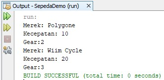
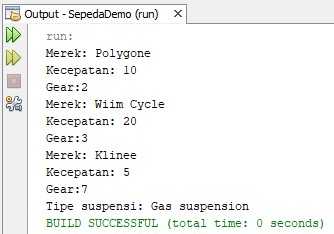
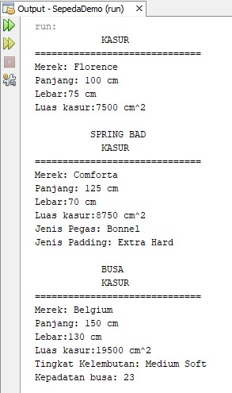
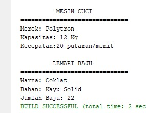

# Laporan Praktikum Pertemuan 1

## A. Screenshoot Output Percobaan 1 

## B. Screenshoot Output Percobaan 2

## C. Penjelasan Program Percobaan 
Pada program percobaan, terdapat 2 objek yaitu objek sepeda gunung dan sepeda, yang mana objek sepeda mewarisi objek sepeda gunung (inheritance). Terdapat 3 class yaitu class Sepeda untuk objek sepeda, class SepedaGunung untuk objek sepeda gunung, dan class SepedaDemo untuk main method yang berfungsi untuk menjalankan program dan menginstansiasikan objek untuk setiap class.
 
Class Sepeda memiliki 3 atribut yaitu merek, kecepatan, dan gear untuk menyimpan masing-masing datanya. Terdapat 5 method diantaranya yaitu menentukan merek sepeda, mengganti gear, menambah kecepatan, mengerem, dan mencetak status/data sepeda.
 
Class sepeda gunung menggunakan fitur inheritance karena di-extends/diwariskan dari class Sepeda. Class ini ditambah dengan method menentukan tipe suspense dan cetak status untuk menampilkan tipe suspensinya.
 
Pada class SepedaDemo terdapat 3 buah instansiasi objek untuk memanggil method-method di dalam class Sepeda dan SepedaGunung sehingga output nya akan menampilkan 3 macam data sepeda yang berbeda.

## D. Screenshoot Output Tugas Praktikum 

## E. Penjelasan Program Tugas 
Terdapat 4 objek yaitu kasur spring bad, kasur busa, mesin cuci, dan lemari baju. Ada satu tambahan objek yaitu kasur yang mewarisi objek kasur spring bad dan kasur busa. Juga terdapat 6 class untuk masing-masing objek kecuali ada satu class yang menyimpan method main untuk menjalankan program dan menginstansiasikan objek untuk setiap class. Berikut penjelasan masing-masing class, diantaranya :

1. Kasur

Atribut : merek, panjang, lebar, dan luas
 
Method : serMerek untuk menentukan merek, tambahPanjang, kurangiPanjang, tambahLebar, kurangiLebar, luasKasur untuk menghitung luas kasur, cetakStatus untuk menampilkan semua data.

2. KasurSpringBad

KasurSpringBad diwarisi oleh objek kasur sehingga atribut dan methodnya sama. Oleh karena itu menggunakan fitur inheritance untuk meng-extendsnya agar tidak menuliskan ulang code program. Berikut tambahan atribut dan method pada class KasurSpringBad :
 
Atribut : jenisPegas, padding
 
Method : serJenisPegas untuk menentukan pegas yang digunakan, setPadding untuk menentukan jenis padding yang digunakan, cetakStatus untuk menampilkan data tambahan tersebut.

3. KasurBusa

KasurBusa kedudukannya sama sperti KasurSpringBad yaitu sebagai objek yang diwarisi oleh kasur. Berikut tambahan atribut dan method pada objek KasurBusa :
 
Atribut : tingkatKelembutan, kepadatanBusa
 
Method : setTingkatKelembutan untuk mengetahui tingkat kelebutannya, setKepadatan untuk mengetahui kepadatan busa yang digunakan, cetakStatus untuk menampilkan data tambahan tersebut.

4. MesinCuci

Atribut : merek, kapasitas, kecepatan
 
Method : menetukan merek, menambah kapasitas, mengurangi kapasitas, menambah kecepatan, mengurangi kecepatan, cetakStatus untuk menampilkan semua data.

5. LemariBaju

Atribut : merek, kapasitas, dan kecepatan
 
Method : serMerek untuk menentukan mereknya, tambahKapasitas, kurangiKapasitas, tambahKecepatan, kurangiKecepatan, cetakStatus untuk menampilkan semua data.

6. TugasDemo

Pada class ini tidak ada atribut dan hanya terdiri 1 method yaitu method main untuk menjalankan program. Di class ini juga terdapat 5 buah instansiasi objek untuk memanggil method-method di dalam class Kasur, KasurSpringBad, KasurBusa, MesinCuci, dan LemariBaju sehingga output nya akan menampilkan 5 macam data yang berbeda yaitu data kasur, data kasur spring bad, data kasur busa, data mesin cuci, dan data lemari baju. Untuk lebih jelasnya seperti pada Screenshoot Output Tugas Praktikum.

