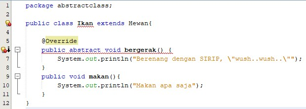

# LAPORAN PRAKTIKUM JOBSHEET 10 – ABSTRACT CLASS

## A. Hasil Ouput Percobaan Praktikum

## B. Pertanyaan Diskusi
Bolehkah apabila sebuah class yang meng-extend suatu abstract class tidak mengimplementasikan method abstract yang ada di class induknya? Buktikan!  Jawaban : Tidak boleh karena jika tidak mengimplementasikan method abstract yang ada di class induknya maka akan terjadi eror. Berikut buktinya :  

## C. Pertanyaan
1. Berikan penjelasan terkait tentang jalannya program diatas !  Jawaban : Pada program terdapat 5 class, yang mana class ikan dan kucing di extend pada class hewan yang merupakan abstract class sehingga pada class induk harus mengimplementasikan metode abstrak pada class induknya. Pada main class terdapat empat instansiasi objek untuk memanggil method yang terdapat pada ada class Orang, class Kucing, dan class Ikan sehingga menghasilkan output seperti pada praktikum di atas.

2. Tunjukkan hasil kompilasi program dan berikan penjelasan singkat jika method bergerak() diubah menjadi method abstract!  Jawaban : Pada class Hewan, method bergerak () sudah menjadi method abstract karena class Hewan merupakan class abstract. Namun apabila method bergerak () pada class Ikan dan Kucing diubah menjadi method abstract, maka akan terjadi eror karena class Ikan dan Kucing bukan class abstract. Berikut buktinya :     Berikut outputnya ketika dikompilasi :  

3. Tunjukkan hasil kompilasi program dan berikan penjelasan singkat jika tidak dilakukan overriding terhadap method bergerak() !  Jawaban : Terjadi eror karena subclass yang di-ekstends pada class abstract, maka semua method pada subclass diimplementasikan sebagai mehod abstract sehingga harus ada overriding nya. Berikut buktinya :  

4. Tunjukkan hasil kompilasi program dan berikan penjelasan singkat jika abstract method bergerak()yang dideklarasikan dalam Class Ikan !  Jawaban : Terjadi eror ketika abstract method bergerak () dideklarasikan dalam class Ikan karena class Ikan bukanlah class abstract. Berikut buktinya :    Kecuali jika pada class Ikan ditambahi abstract (menjadi class abstract) dan pada method bergerak () diubah menjadi modifier abstract. Kemudian pada main class, instansiasi objek Ikan diimplementasikan semua method abstract, maka tidak akan terjadi eror lagi. Berikut buktinya :   

