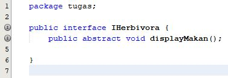

# LAPORAN JOBSHEET 11 – INTERFACE DALAM OOP JAVA
## A. Output Percobaan 1
Pada percobaan 1 langkah ke-9 terdapat kode program yang eror, maka untuk memperbaikinya agar output sesuai dengan langkah percobaan ke-10 adalah dengan cara memberikan komentar pada baris program yang eror ataupun bisa juga dengan cara menghapus kode program tersebut.    
Berikut output yang dihasilkan setelah kode program diperbaiki, hasilnya sudah sesuai dengan percobaan pada langkah ke-10.  
## B. Jawaban Pertanyaan Percobaan 1
1. Pada langkah ke 9, pada baris program ke 3 terdapat warning pada script tersebut. Jelaskan penyebab terjadinya hal tersebut ?  Jawaban : Terdapat warning pada baris program ke 3 dikarenakan import tersebut unused atau tidak digunakan pada program tersebut dan juga karena import tersebut berada pada package yang sama.

2. Pada langkah ke 9, pada baris program ke 3. Apa yang terjadi jika script tersebut dihilangkan? Jelaskan menurut pemahaman anda.  Jawaban : Ketika baris program ke 3 dihilangkan, maka tidak terjadi eror dan output tetap seperti semula, hal tersebut terjadi karena baris kode yang dihilangkan adalah kode program yang unused sehingga meskipun dihilangkan tidak terjadi eror ataupun perubahan pada output program.

3. Mengapa pada langkah nomor 9 terjadi error? Jelaskan!  Jawaban : Terjadi eror karena objek mhsBiasa yang diinstansiasi dari class Mahasiswa belum di-implements pada class interface ICumlaude.

4. Dapatkah method kuliahDiKampus() dipanggil dari objek sarjanaCumlaude di class Program? Mengapa demikian?  Jawaban : Method kuliahDiKampus() dapat dipanggil dari objek sarjanaCumlaude di class Program karena objek sarjanaCumlaude yang terbentuk dari class Sarjana telah di-extends pada class Mahasiswa (class pemilik method kuliahDiKampus()).

5. Dapatkah method kuliahDiKampus() dipanggil dari parameter mahasiswa di method beriSertifikatCumlaude() pada class Rektor? Mengapa demikian?  Jawaban : Method kuliahDiKampus() tidak dapat dipanggil dari parameter mahasiswa di method beriSertifikatCumlaude() pada class Rektor karena method kuliahDiKampus() tidak termasuk method yang di-implements pada class ICumlaude, namun  method kuliahDiKampus() merupakan method di class Mahasiswa jadi tidak ada hubungan diantara kedua class tersebut.

6. Modifikasilah method beriSertifikatCumlaude() pada class Rektor agar hasil eksekusi class Program menjadi seperti berikut ini:  Jawaban : Pada class interface ICumlaude ditambahi method public abstract void kuliahDiKampus(); kemudian pada class Rektor di method beriSertifikatCumlaude() ditambahi baris program mahasiswa.kuliahDiKampus(); Berikut gambar letak perubahan di class interface ICumlaude :   Berikut gambar letak perubahan di class Rektor :  
## C. Output Percobaan 2
Pada percobaan 2 langkah ke-5 terdapat kode program yang eror, maka untuk memperbaikinya agar output sesuai dengan langkah percobaan ke-6 adalah dengan cara memberikan komentar pada baris program yang eror ataupun bisa juga dengan cara menghapus kode program tersebut.    
Berikut output yang dihasilkan setelah kode program diperbaiki, hasilnya sudah sesuai dengan percobaan pada langkah ke-6.  
## D. Jawaban Pertanyaan Percobaan 2
1. Pada script code interface IBerprestasi, modifikasi script tersebut sesuai dengan gambar dibawah ini :  Dari perubahan script diatas, apa yang terjadi ? serta jelaskan alasannya (capture hasilnya) Jawaban : Terjadi eror karena aturan dalam struktur penulisan interface, modifier method yang diperbolehkan hanya public saja. Berikut hasil capturenya : 

2. Perhatikan script code dibawah ini : Jelaskan menurut anda, mengapa hasil dari script code tersebut error ?  Jawaban : Terjadi eror karena IBerprestasi merupakan class interface, sedangkan class Interface tidak dapat dibuat objek instance-nya dengan kata kunci new.

3. Apabila Sarjana Berprestasi harus menjuarai kompetisi NASIONAL dan menerbitkan artikel di jurnal NASIONAL, maka modifikasilah class-class yang terkait pada aplikasi Anda agar di class Program objek pakRektor dapat memberikan sertifikat mawapres pada objek sarjanaCumlaude.  Jawaban : Pada class Sarjana ditambahkan interface baru IBerprestasi dibelakang kata kunci implements. Lalu dengan cara yang sama seperti sebelumnya, kliklah ikon lampu peringatan untuk meng-generate semua method abstract dari interface IBerprestasi pada class Sarjana. Lakukan langkahnya sama seperti class PascaSarjana.  Berikut gambar modifikasinya :  
## E. UML Class Diagram Tugas 
Berikut hasil UML dari deskripsi permasalahan pada tugas   
## F. Laporan Tugas 
Berikut langkah-langkah dalam mengimplementasikan class diagram tersebut menjadi sistem pada java :  
1. Membuat class interface dengan nama IKarnivora. Kemudian tambahkan method public abstract void displayMakan(); di dalam class tersebut. Class ini nantinya yang akan digunakan sebagai implements untuk class Singa dan Gorilla.  Berikut kode programnya :  

2. Membuat class interface dengan nama IHerbivora. Kemudian tambahkan method public abstract void displayMakan(); di dalam class tersebut. Class ini nantinya yang akan digunakan sebagai implements untuk class Keledai dan Gorilla.  Berikut kode programnya :  

3. Membuat class abstract dengan Nama Binatang yang nantinya class ini akan menjadi super Class dari class Singa, Keledai, dan Gorilla. Untuk atribut dan methodnya sesuaikan dengan diagram class yang telah dibuat sebelumnya.  Berikut kode programnya :  

4. Membuat class Singa yang merupakan turunan dari class Binatang. Class Singa di-extends pada class Binatang, kemudian dibuat meng-implements interface IKarnivora yang sudah dibuat sebelumnya tadi. Untuk atribut dan methodnya sesuaikan dengan diagram class yang telah dibuat sebelumnya.  Tips: kita dapat menggunakan fasilitas override otomatis dengan cara mengklik ikon lampu peringatan.  Berikut kode programnya :  

5. Membuat class Keledai yang merupakan turunan dari class Binatang. Class Keledai di-extends pada class Binatang, kemudian dibuat meng-implements interface IHerbivora yang sudah dibuat sebelumnya tadi. Untuk atribut dan methodnya sesuaikan dengan diagram class yang telah dibuat sebelumnya.  Tips: kita dapat menggunakan fasilitas override otomatis dengan cara mengklik ikon lampu peringatan.  Berikut kode programnya :  

6. Membuat class Keledai yang merupakan turunan dari class Binatang. Class Keledai di-extends pada class Binatang, kemudian dibuat meng-implements interface IKarnivora dan juga IHerbivora yang sudah dibuat sebelumnya tadi. Untuk atribut dan methodnya sesuaikan dengan diagram class yang telah dibuat sebelumnya.  Tips: kita dapat menggunakan fasilitas override otomatis dengan cara mengklik ikon lampu peringatan.  Berikut kode programnya :  

7. Membuat main class dengan menginstansiasi 3 objek di dalamnya, yaitu objek dari class Singa, Keledai, dan Gorilla. Kemudian memanggil 3 method displayMakan, displayBinatang, dan displayData dari ketiga class tersebut.  Berikut kode programnya :  
## G. Output Program Tugas 
Berikut hasil output dari program yang telah dibuat. Hasilnya sudah sesuai dengan yang diminta pada tugas :   

