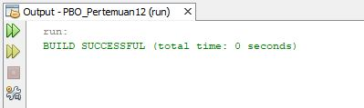
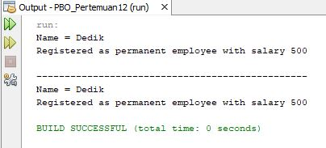
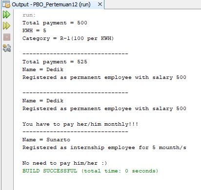
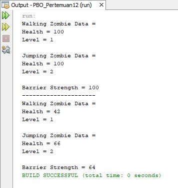

# LAPORAN JOBSHEET POLIMORFISME
## A. Output Percobaan 1

## B. Jawaban Pertanyaan Percobaan 1
1. Class apa sajakah yang merupakan turunan dari class Employee?  Jawaban : Class yang merupakan turunan dari class Employee adalah class InternshipEmployee dan PermanentEmployee.

2. Class apa sajakah yang implements ke interface Payable?  Jawaban : Class yang implements ke interface Payable adalah class ElectricityBill dan PermanentEmployee.

3. Perhatikan class Tester1, baris ke-10 dan 11. Mengapa e, bisa diisi dengan objek pEmp (merupakan objek dari class PermanentEmployee) dan objek iEmp (merupakan objek dari class InternshipEmploye) ?  Jawaban : Karena e menginisialisasikan class Employee, kemudian objek pEmp dan iEmp dibentuk dari class yang merupakan turunan dari class Employee, sehingga e bisa diisi dengan kedua objek tersebut.

4. Perhatikan class Tester1, baris ke-12 dan 13. Mengapa p, bisa diisi dengan objek pEmp (merupakan objek dari class
PermanentEmployee) dan objek eBill (merupakan objek dari class ElectricityBill) ?  Jawaban : Karena p menginisialisasikan class interface Payable, kemudian objek pEmp dan eBill dibentuk dari class yang di-implements pada class interface Payable, sehingga p bisa diisi dengan kedua objek tersebut.

5. Coba tambahkan sintaks:  p = iEmp;  e = eBill;  pada baris 14 dan 15 (baris terakhir dalam method main) ! Apa yang menyebabkan error?  Jawaban : Baris 14 terjadi eror karena objek iEmp yang terbentuk dari class InternshipEmploye tidak di-implements pada class interface Payable. Kemudian baris 15 juga terjadi eror karena objek eBill yang terbentuk dari class ElectricityBill tidak di-extends pada class Employee.

6. Ambil kesimpulan tentang konsep/bentuk dasar polimorfisme!  Jawaban : kesimpulannya adalah Polimorfisme merupakan kemampuan suatu objek untuk memiliki banyak bentuk. Ketika ada suatu objek yang dideklarasikan dari super class, maka objek tersebut bisa diinstansiasi sebagai objek dari sub class. Hal tersebut menandakan bahwa konsep polimorfisme bisa diterapkan pada class-class yang memiliki relasi inheritance (relasi generalisasi atau IS-A) dan juga relasi dalam interface.

## C. Output Percobaan 2

## D. Jawaban Pertanyaan Percobaan 2
1. Perhatikan class Tester2 di atas, mengapa pemanggilan e.getEmployeeInfo() pada baris 8 dan pEmp.getEmployeeInfo() pada baris 10 menghasilkan hasil sama ?  Jawaban : Hasil pemanggilannya sama dikarenakan pada baris ke-8, pemanggilan overriding method (getEmployeeInfo()) dari suatu objek polimorfisme e (class Employee). Pada saat itu terjadi pemaggilan method virtual saat compile time. Namun saat  dijalankan (run time), yang akan dijalankan adalah method yang ada di class PermanentEmployee (class dari objek pEmp). Kemudian pada baris ke-10 (pEmp.getEmployeeInfo()), yang dikenali saat compile time oleh compiler dan yang dijalankan saat runtime oleh JVM adalah sama-sama method getEmployeeInfo() yang ada di class PermanentEmployee(class dari objek pEmp). Hal tersebut terjadi karena objek pEmp dideklarasikan dari class PermanentEmployee.

2. Mengapa pemanggilan method e.getEmployeeInfo() disebut sebagai pemanggilan method virtual (virtual method invication), sedangkan pEmp.getEmployeeInfo() tidak ?  Jawaban : Pemanggilan method e.getEmployeeInfo() disebut sebagai pemanggilan method virtual karena antara method yang dikenali
oleh compiler dan method yang dijalankan oleh JVM berbeda. Sedangkan pemanggilan method pEmp.getEmployeeInfo(), yang dikenali oleh compiler dan method yang dijalankan oleh JVM sama.

3. Jadi apakah yang dimaksud dari virtual method invocation? Mengapa disebut virtual? <bt>Jawaban : Virtual method invocation adalah pemanggilan overriding method dari
suatu objek polimorfisme. Disebut virtual karena antara method yang dikenali oleh compiler dan method yang dijalankan oleh JVM berbeda.

## E. Jawaban Pertanyaan Percobaan 3
1. Perhatikan array e pada baris ke-8, mengapa ia bisa diisi dengan objek-objek dengan tipe yang berbeda, yaitu objek pEmp (objek dari PermanentEmployee) dan objek iEmp (objek dari InternshipEmployee) ?  Jawaban : Karena array e[] dideklarasikan dari class Employee yang merupakan superclass dari class PermanentEmployee (class dari objek pEmp) dan InternshipEmployee (class dari objek iEmp).

2. Perhatikan juga baris ke-9, mengapa array p juga biisi dengan objek-objek dengan tipe yang berbeda, yaitu objek pEmp (objek dari PermanentEmployee) dan objek eBill (objek dari
ElectricityBilling) ?  Jawaban : Karena array p[] dideklarasikan dari class interface Payable yang merupakan superclass dari class PermanentEmployee (class dari objek pEmp) dan ElectricityBill (class dari objek eBill).

3. Perhatikan baris ke-10, mengapa terjadi error ?  Jawaban : terjadi eror karena objek eBill yang berasal dari class ElectricityBill bukan subclass atau tidak dideklarasikan pada superclass Employee (class dari array e2[]) sehingga terjadi eror.

## F. Output Percobaan 4

## G. Jawaban Pertanyaan Percobaan 4
1. Perhatikan class Tester4 baris ke-7 dan baris ke-11, mengapa pemanggilan ow.pay(eBill) dan ow.pay(pEmp) bisa dilakukan, padahal jika diperhatikan method pay() yang ada di dalam class Owner memiliki argument/parameter bertipe Payable ? Jika diperhatikan lebih detil eBill merupakan objek dari ElectricityBill dan pEmp merupakan objek dari PermanentEmployee?  Jawaban : Karena method pay() memiliki argument berupa Payable yang memiliki subclass ElectricityBill dan PermanentEmployee, sehingga method pay() bisa menerima argument berupa objek dari class ElectricityBill dan PermanentEmployee. 

2. Jadi apakah tujuan membuat argument bertipe Payable pada method pay() yang ada di dalam class Owner ?  Jawaban : Tujuannya adalah agar method pay() bisa menerima argument berupa objek dari class ElectricityBill dan PermanentEmployee yang merupakan subclass dari class Payable.

3. Coba pada baris terakhir method main() yang ada di dalam class Tester4 ditambahkan perintah ow.pay(iEmp);  Mengapa terjadi error ?  Jawaban : Terjadi eror karena objek iEmp yang berasal dari class InternshipEmployee tidak diterima argumentnya sebab class InternshipEmployee bukan subclass dari argument bertipe Payable, sedangkan pada method pay() bisa menerima argument berupa objek yang berasal dari subclassnya Payable, sehingga terjadi eror.

4. Perhatikan class Owner, diperlukan untuk apakah sintaks p instanceof ElectricityBill pada baris ke-6 ?  Jawaban : Sintaks p instanceof ElectricityBill pada baris ke-6 digunakan untuk mengecek apakah objek p merupakan hasil instansiasi dari class ElectricityBill.

5. Perhatikan kembali class Owner baris ke-7, untuk apakah casting objek disana (ElectricityBill eb = (ElectricityBill) p) diperlukan ? Mengapa objek p yang bertipe Payable harus di-casting ke dalam objek eb yang bertipe ElectricityBill ?  Jawaban : Casting objek tersebut digunakan untuk mengubah tipe dari objek eb (objek subclass dari Payable) menjadi tipe objek p (objek dari class Payable) atau bisa juga proses ini disebut dengan upcasting. Objek p yang bertipe Payable harus di-casting ke dalam objek eb yang bertipe ElectricityBill karena kode program yang ditulis hanya berhubungan dengan superclass.

## G. Output Tugas

