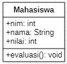
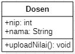
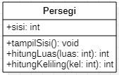

# TUGAS TEORI PERTEMUAN 2

## A. LATIHAN 1
1. Ada 4 class dalam membangun system informasi di JTI, diantaranya yaitu Mahasiswa, mata kuliah, dosen, dan mainClass.
2. Class Diagram Mahasiswa

 
Class Diagram MataKuliah

 
Class Diagram Dosen

 
Class MainClass

  
Untuk implementasi dalam bahasa pemrograman Java, terdapat pada folder Pertemuan 2/Tugas Teori/Convert java/Sistem Informasi/Model

## B. LATIHAN 2

Class Diagram Mahasiswa

 
Class Diagram MataKuliah

 
Class Diagram Dosen

 
Class MainClass

 

## C. LATIHAN 3

Class Persegi

 
Class TampilPersegi

  
Untuk implementasi dalam bahasa pemrograman Java, terdapat pada folder Pertemuan 2/Tugas Teori/Convert java/Persegi/Model

