# LAPORAN PRAKTIKUM JOBSHEET 3 (ENKAPSULASI PADA PBO)

## A. Screenshoot Output Percobaan 1-Enkapsulasi

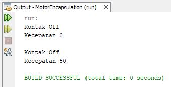

## B. Screenshoot Output Percobaan 2-Access Modifier

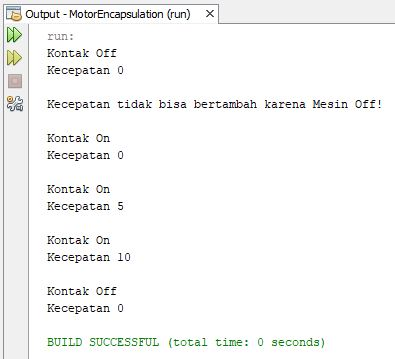

## C. Screenshoot Output Percobaan 3-Getter dan Setter

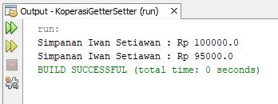

## D. Screenshoot Output Percobaan 4-Konstruktor, Instansiasi
1. Perubahan output yang pertama

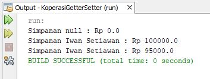

2. Perubahan output yang kedua

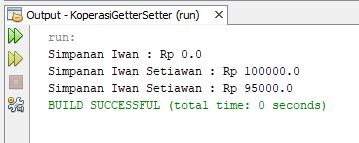

## E. TUGAS (Untuk source code tugas ada di folder TugasPertemuan3)

1. Cobalah program dibawah ini dan tuliskan	hasil outputnya
 
Jawaban :
 
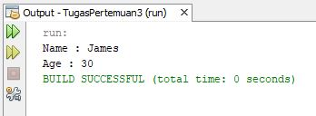

2. Pada program	diatas,	pada class EncapTest kita mengeset age dengan nilai	35, namun pada saat	ditampilkan	ke layar nilainya 30, jelaskan mengapa.
 Jawaban : Karena dalam method setAge terdapat if yang apabila age yang dimasukkan melebihi 30 maka age di anggap 30.
 
3. Ubah program diatas agar atribut age dapat diberi nilai maksimal	30 dan minimal 18.
 
Jawaban : 
 
a. Perubahan code di class EncapDemo

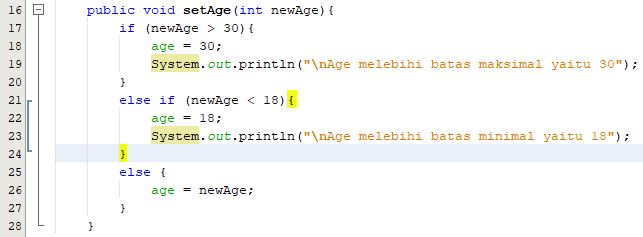

b. Perubahan code di class EncapTest

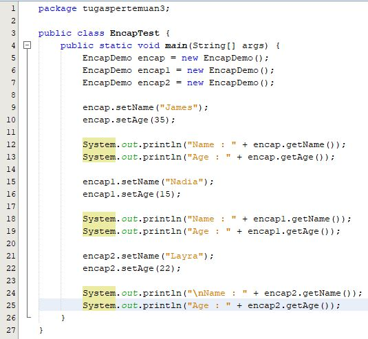

c. Output dari perubahan kode di atas 

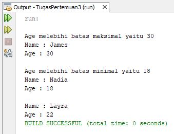

4. Pada	sebuah sistem informasi	koperasi simpan	pinjam, terdapat class Anggota yang memiliki atribut antara	lain nomor KTP,	nama, limit	peminjaman,	dan	jumlah pinjaman. Anggota dapat meminjam	uang dengan	batas limit	peminjaman yang	ditentukan.	Anggota	juga dapat mengangsur pinjaman.	Ketika Anggota tersebut	mengangsur pinjaman, maka jumlah pinjaman akan berkurang sesuai	dengan nominal yang	diangsur. Buatlah class Anggota	tersebut, berikan atribut, method dan konstruktor sesuai dengan	kebutuhan. Uji dengan TestKoperasi berikut ini untuk memeriksa apakah class Anggota	yang anda buat telah sesuai	dengan yang	diharapkan.
 Jawaban : 
 
a. Berikut source code pada class Anggota

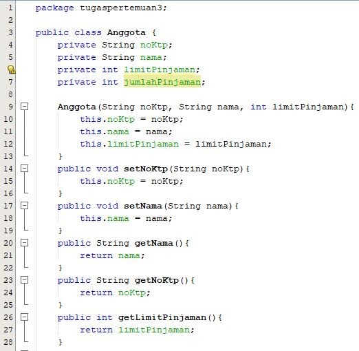
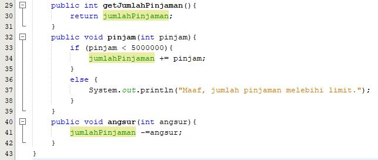

b. Berikut Hasil Outputnya (sudah sesuai dengan yang diminta pada soal)

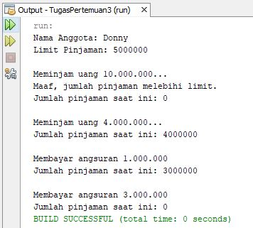

5. Modifikasi soal no. 4 agar nominal yang dapat diangsur minimal adalah 10% dari jumlah pinjaman saat ini.	Jika mengangsur	kurang dari itu, maka muncul peringatan	“Maaf, angsuran	harus 10% dari jumlah pinjaman”.
 Jawaban :
 
a. Letak modifikasi pada class Anggota

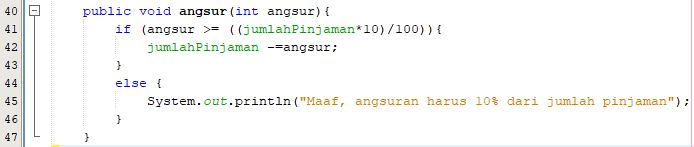

b. Letak modifikasi pada class TestKoperasi

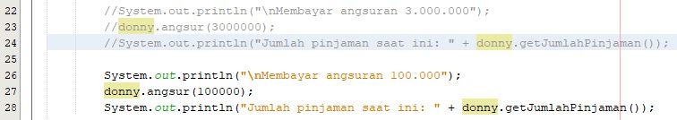

c. Berikut Output setelah dimodifikasi

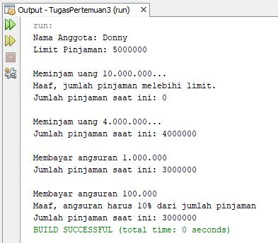

6. Modifikasi class TestKoperasi, agar jumlah pinjaman dan angsuran	dapat menerima input dari console.
 Jawaban :
 
a. Berikut bentuk modifikasinya 

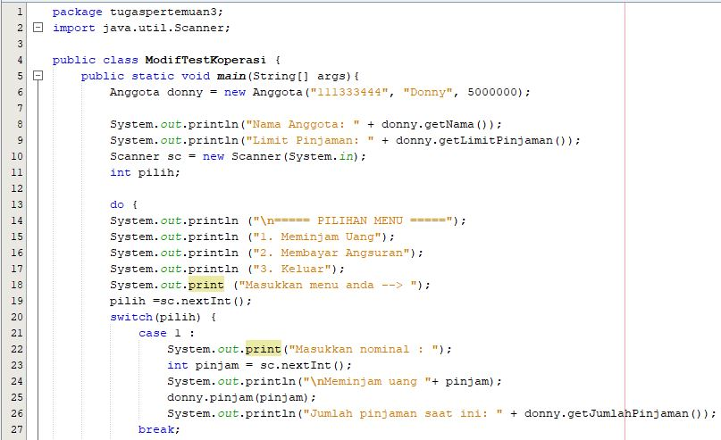
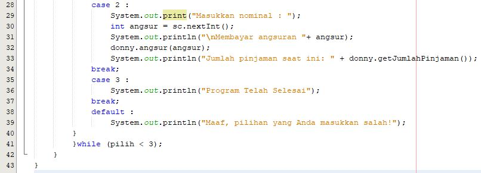

b. Berikut Output setelah dimodifikasi

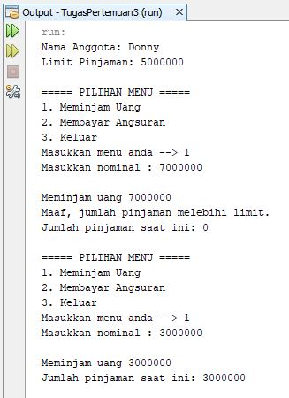
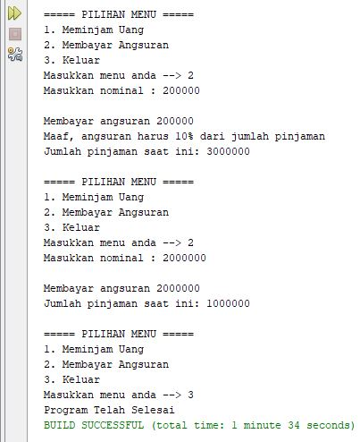

