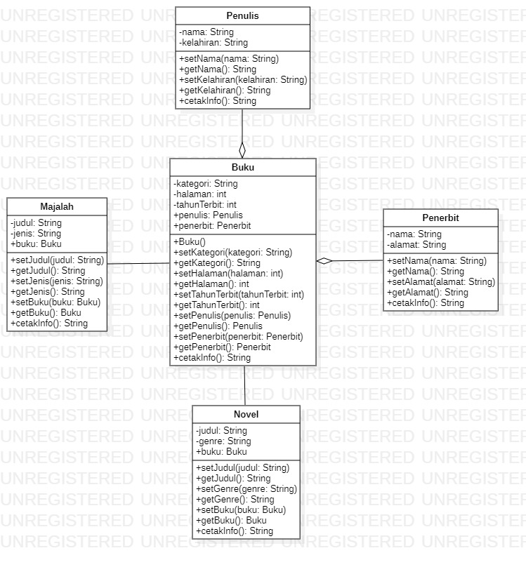

# LAPORAN TUGAS PRAKTIKUM 4

## A. STUDI KASUS

Studi kasus yang saya gunakan adalah tentang Buku, yang mana setiap buku pasti mempunyai beberapa info tentang buku, judul, penulis, penerbit, dan lainnya. Dalam program saya terdapat 6 class, diantaranya yaitu ada class Buku, Penulis, Penerbit, Novel, Majalah, dan Main class. Relasi antara class Buku, Penulis, dan Penerbit adalah agregasi. Sedangkan relas antara class Buku, Novel, dan Majalah adalah inheritance. Untuk atribut dan method di masing-masing classnya bisa dilihat pada class diagram yang akan saya tampilkan. Sedangkan untuk source codenya bisa dilihat pada folder Pertemuan 4\PBO_Pertemuan4.

## B. CLASS DIAGRAM

## C. HASIL OUTPUT PROGRAM 

Jalannya program dimulai dari mendeklarasi dan menginstansiasikan setiap objek. Di dalam class Buku, terdapat method untuk memanggil method info dari class Penulis dan Penerbit. Sedangkan di dalam class Novel dan Majalah terdapat method untuk memanggil method info dari class Buku yang nantinya untuk ditampilkan pada output ketika memanggil method info dari class Novel dan Majalah. Sehingga output keseluruhan dari program mewakili masing-masing method info dari setiap class. 