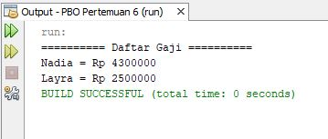

# LAPORAN JOBSHEET 6

## A. JAWABAN PERTANYAAN PERCOBAAN 1
1. Pada percobaan 1 diatas program yang dijalankan terjadi error, kemudian perbaiki sehingga program tersebut bisa dijalankan dan tidak error!  Jawaban : Di classB ditambahi extends classA kemudian untuk pemanggilan atribut x dan y ditambahi super.

2. Jelaskan apa penyebab program pada percobaan 1 ketika dijalankan terdapat error!  Jawaban : Terjadi eror karena ClassB belum di extends ke Class induknya yaitu classA dan dalam pemanggilan atribut dari class induk belum ditambahi super.

## B. JAWABAN PERTANYAAN PERCOBAAN 2
1. Pada percobaan 2 diatas program yang dijalankan terjadi error, kemudian perbaiki sehingga program tersebut bisa dijalankan dan tidak error! Di classA ditambahi method getX dan getY, kemudian di classB dalam pemanggilan atribut x dan y menggunakan super.getX dan super.getY

2. Jelaskan apa penyebab program pada percobaan 1 ketika dijalankan terdapat error!  Jawaban : Terjadi eror karena ClassB belum di extends ke Class induknya yaitu classA dan dalam pemanggilan atribut x dan y tidak bisa karena memiliki modifier private, solusinya yaitu membuat method get untuk atribut x dan y di ClassA kemudian untuk pemanggilannya di ClassB menggunakan super.namaMethodGet x dan y

## C. JAWABAN PERTANYAAN PERCOBAAN 3
1. Jelaskan fungsi “super” pada potongan program berikut di class Tabung!  Jawaban : Untuk merujuk/mengakses atribut dari parent class/superclass yaitu dari class Bangun

2. Jelaskan fungsi “super” dan “this” pada potongan program berikut di class Tabung!  Jawaban : Super digunakan untuk mengakses atribut phi dan r dari parent class/superclass (Bangun), kemudian this digunakan untuk mengakses atribut t dari class itu sendiri (class Tabung)

3. Jelaskan mengapa pada class Tabung tidak dideklarasikan atribut “phi” dan “r” tetapi class tersebut dapat mengakses atribut tersebut!  Jawaban : Karena class Tabung merupakan child class dari class Bangun dan class tabung telah di extends ke class bangun yang mana di class Bangun telah dideklarasikan atribut phi dan r sehingga di class Tabung tidak perlu dideklarasikan ulang dan tetap bisa mengakses atributnya.

## D. JAWABAN PERTANYAAN PERCOBAAN 4
1. Pada percobaan 4 sebutkan mana class yang termasuk superclass dan subclass, kemudian jelaskan alasannya!  Jawaban : ClassA merupakan superclass dari classB karena classB diextends dari clssA, classB merupakan superclass dari classC karena classC diextends dari classB , classC merupakan subclass dari classB, classB merupakan subclass dari classA

2. Tambahkan kata super() di baris Pertaman dalam konstruktor defaultnya. Coba jalankan kembali class Percobaan4 dan terlihat tidak ada perbedaan dari hasil outputnya!  Jawaban : Tidak ada perbedaan dari hasil outputnya

3. Jelaskan bagaimana urutan proses jalannya konstruktor saat objek test dibuat!  Jawaban : Urutan jalannya proses yaitu classC memanggil classB terlebih dahulu karena dia diextends dari classB, kemudian classB memanggil classA terlebih dahulu karena dia diextends dari classA, sehingga outputnya urut dari superclass yang paling awal yaitu classA, kemudian classB, lalu dilanjutkan classC

4. Apakah fungsi super() pada potongan program dibawah ini di ClassC!  Jawaban : Berfungsi untuk merujuk/memanggil konstruktor superclass dan perintah ini hanya bisa digunakan dibaris pertama dalam konstruktor

## E. TUGAS 
1. Hasil output program tugas

2. Penjelasan Jalannya Program  class Dosen merupakan child class dari Pegawai. Kemudian di class DaftarGaji juga menggunakan atribut bertipe pegawai berupa array untuk menampilkan banyak pegawai beserta gajinya. Pada class main dibuat 3 objek, yang pertama objek d1(Dosen) untuk menge-set nama dan SKS. Objek yang ke-2 yaitu p1(Pegawai) untuk menge-set nama. Lalu objek yang k2-3 yaitu dg(DaftarGaaji) untuk memampilkan data yang sudah diisi ketika di objek 1 dan 2.

