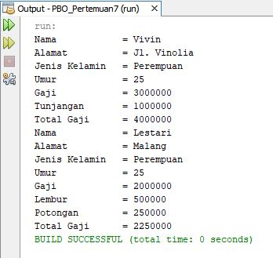
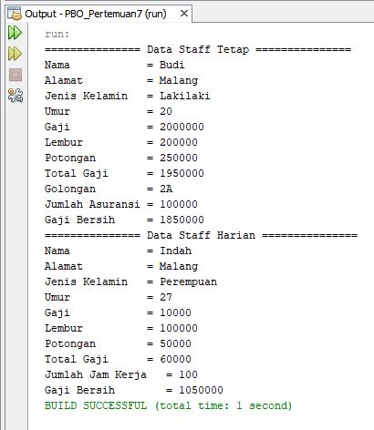
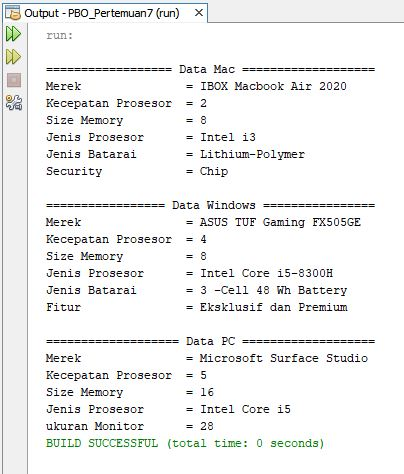

# LAPORAN JOBSHEET 7

## A. HASIL OUTPUT PERCOBAAN 1

Output yang dihasilkan berupa data Manager dan data Staff dengan menggunkan objek manager dan staff pada class main, yang mana kedua objek tersebut berasal dari class yang merupakan turunan dari class Karyawan sehingga class Menager dan Staff di extends pada class karyawan. Pada class Manager terdapat tambahan data tunjangan, sedangkan pada class Staff terdapat tambahan data lembur dan potongan. Untuk selebihnya datanya sama dengan data di class Karyawan.

## B. JAWABAN PERTANYAAN PERCOBAAN 1
1. Sebutkan class mana yang termasuk super class dan sub class dari percobaan 1 diatas!  Jawaban : Class Karyawan merupakan super class dari Class Manager dan Staff, sedangkan class Manager dan Staff merupakan sub class dari class Karyawan

2. Kata kunci apakah yang digunakan untuk menurunkan suatu class ke class yang lain?  Jawaban : Di dalam Java untuk mendeklarasikan suatu class sebagai subclass dilakukan dengan cara menambahkan kata kunci extends setelah deklarasi nama class, kemudian diikuti dengan nama parent class-­­nya. Kata kunci extends tersebut memberitahu kompiler Java bahwa kita ingin melakukan perluasan class. Berikut contoh penerapannya : public class B extends A {........}

3. Perhatikan kode program pada class Manager, atribut apa saja yang dimiliki oleh class tersebut? Sebutkan atribut mana saja yang diwarisi dari class Karyawan!  Jawaban :  a. Atribut yang dimiliki oleh class Manager : tunjangan  b. Atribut yang diwarisi dari class Karyawan : nama, alamat, jk, umur, gaji

4. Jelaskan kata kunci super pada potongan program dibawah ini yang terdapat pada class Manager!  Jawaban : Kata kunci super tersebut digunakan untuk memanggil atribut gaji pada super class (Karyawan)

5. Program pada percobaan 1 diatas termasuk dalam jenis inheritance apa? Jelaskan alasannya!  Jawaban : Termasuk inheritance Hierarchical karena sebuah class memiliki lebih dari satu class turunan (subclass) atau dengan kata lain, lebih dari satu sub class memiliki kelas induk yang sama. Dapat dilihat bahwa class Karyawan memiliki 2 subclass, yaitu Manager dan Staff.
Dengan demikian, class Manager dan Staff memiliki superclass yang sama yaitu class Karyawan, dan ada kemungkinan kedua class subclass tersebut memiliki atribut dan behaviour yang sama dari class Karyawan.

## C. HASIL OUTPUT PERCOBAAN 2

Output yang dihasilkan berupa data Staff Tetap dan Staff Harian dengan menggunakan objek StaffTetap dan StaffHarian pada class main, yang mana kedua class tersebut berasal dari class yang merupakan turunan dari class Staff sehingga class StaffTatap dan StaffHarian di-extends pada class Staff. Pada class StaffTetap terdapat tambahan atribut golongan dan asuransi, sedangkan di class StaffHarian terdapat atribut tambahan jmlJamKerja. Untuk selebihnya datanya sama dengan data di class Staff yang di-extends pada class Karyawan sehingga data pada clas Karyawan juga termasuk.

## D. JAWABAN PERTANYAAN PERCOBAAN 2
1. Berdasarkan class diatas manakah yang termasuk single inheritance dan mana yang termasuk multilevel inheritance?  Jawaban :  a. Single inheritance : Manager, StaffTetap, StaffHarian  b. Multilevel inheritance : Staff

2. Perhatikan kode program class StaffTetap dan StaffHarian, atribut apa saja yang dimiliki oleh class tersebut? Sebutkan atribut mana saja yang diwarisi dari class Staff!  Jawaban :  a. Atribut class StaffTetap : golongan, asuransi  b. Atribut class StaffHarian : jmlJamKerja  c. Atribut yang diwarisi dari class Staff : lembur dan potongan. Karena class Staff diwarisi dari class Karyawan, maka ada atribut yang diwarisi dari class karyawan juga, diantaranya yaitu : nama, alamat, jk, umur, gaji

3. Apakah fungsi potongan program berikut pada class StaffHarian ?  Jawaban : Fungsinya adalah untuk memanggil konstruktor berparameter dari class Staff menggunakan key super

4. Apakah fungsi potongan program berikut pada class StaffHarian ?  Jawaban : Fungsinya adalah untuk memanggil method tampilDataStaff(); dari class Staff menggunakan key super untuk menampilkan semua datanya

5. Perhatikan kode program dibawah ini yang terdapat pada class StaffTetap.  Terlihat dipotongan program diatas atribut gaji, lembur dan potongan dapat diakses langsung. Kenapa hal ini bisa terjadi dan bagaimana class StaffTetap memiliki atribut gaji,
lembur, dan potongan padahal dalam class tersebut tidak dideklarasikan atribut gaji, lembur, dan potongan?  Jawaban : Atribut gaji, lembur, dan potongan dapat diakses langsung karena class StaffTetap telah di-extends pada class Staff dan class staff juga telah di-extends pada class karyawan, kemudian pada class StaffTetap di bagian konstruktor telah dilakukan pemanggilan konstruktor dari class Staff dan juga pada parameternya telah di deklarasikan atribut gaji, lembur, dan potongan sehingga ketiga atributtersebut bisa diakses secara langsung.

## E. TUGAS 

Output yang dihasilkan ada 3 data yaitu data Laptop Mac, Laptop Windows, dan PC dengan menggunakan objek pada main class. class mac dan Windows merupakan turunan dari class laptop dengan menggunakan extends sehingga sebagian datanya diambil dari data laptop. Dikarenakan class Laptop juga turunan dari class Komputer dengan menggunakan extends, maka datanya juga diambil dari class computer. Untuk class Pc merupakan turunan dari class Komputer, maka untuk datanya juga diambil dari class Komputer.

